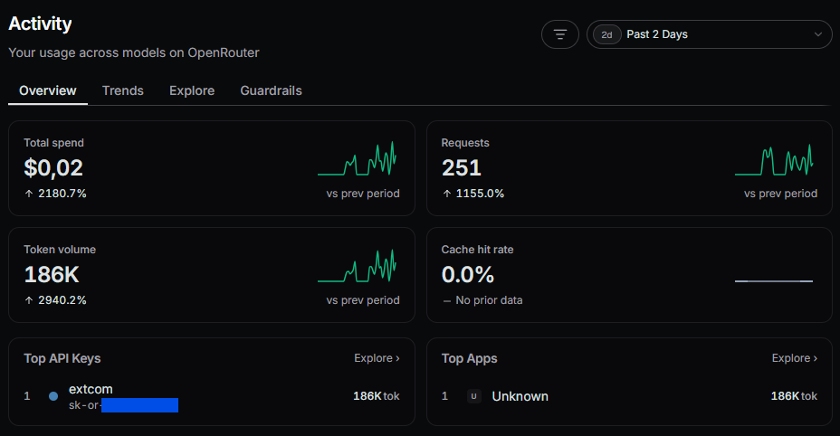
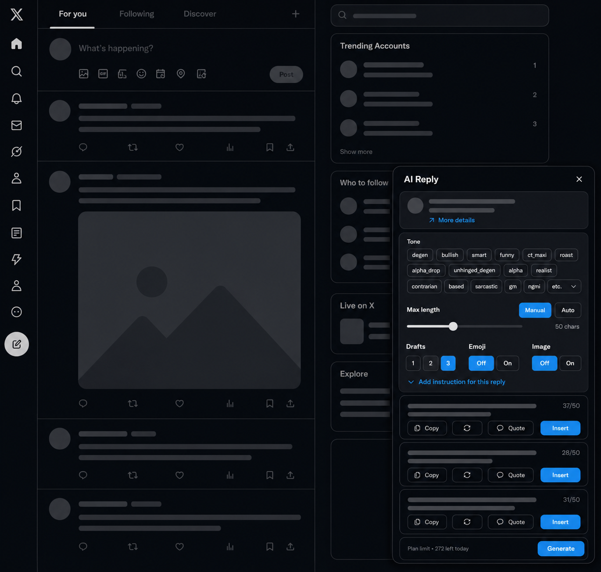
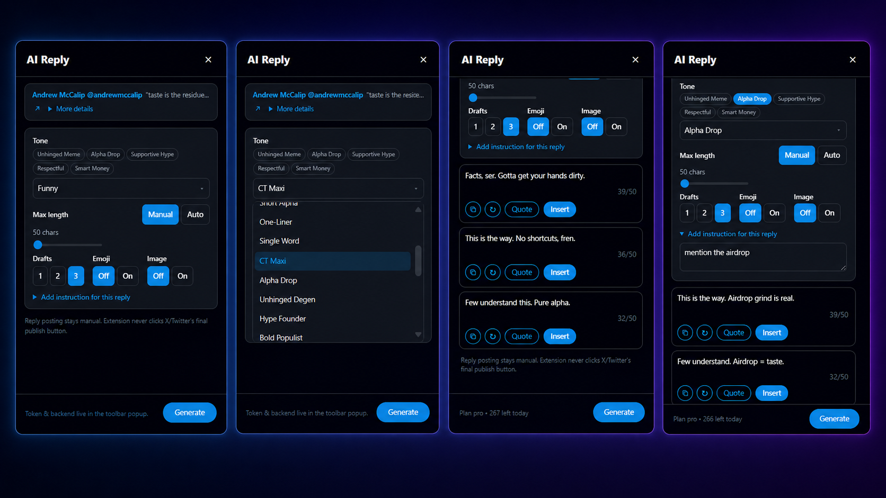

# Extcom AI

A self-hosted AI writing copilot for replies, quotes, and standalone posts on
X/Twitter. The Chrome extension adds two human-in-the-loop workflows:

- **✦ AI Reply** drafts replies and quote-post comments from a post's context.
- **✦ AI Post** creates, rewrites, or continues text in X's standalone composer,
  and can read images you attached to it (charts, screenshots, memes) as visual
  context — including caption-style generation for image-only posts.

Your own backend generates every draft with the AI provider key **you** control.
You choose what to insert, can edit it in X, and **you always press Post yourself**.

- No SaaS, no signup, no telemetry: deploy the backend on your own VPS/PaaS.
- Your AI API key (OpenRouter or OpenAI) never leaves your server.
- Free and open source (MIT).

```txt
Chrome extension ──(your access token)──▶ your backend ──(your API key)──▶ AI provider
```

### Where configuration lives

- **Backend/server environment:** `OPENROUTER_API_KEY` or `OPENAI_API_KEY`,
  `AUTH_TOKENS`, optional `ADMIN_SECRET`, model, and database path.
- **Backend source file (`apps/backend/PERSONA.md`):** optional persistent
  voice/identity applied to every draft this backend generates, no
  per-user setting involved. Ships empty (no effect) by default. It's a
  git-tracked file baked into the Docker image, so on a PaaS deploy,
  editing it means commit + redeploy like any code change (VPS with a live
  checkout can just edit + rebuild locally). See
  [docs/PROMPT.md](docs/PROMPT.md#persona).
- **Extension popup (Tone):** default tone, generation defaults (maximum
  length, draft count, emoji, image reading), standing instruction, and
  blocked terms.
- **Extension popup (Advanced):** public backend URL, one backend access token,
  and an optional AI model override (picked from a live-fetched dropdown or
  typed as custom; it falls back to the backend's `AI_DEFAULT_MODEL` when
  left unset).

Never put an AI-provider API key or admin secret in the extension. Anything
stored by a browser extension must be treated as user-visible. The backend
access token identifies the user and enforces quota; it does not grant direct
access to the AI provider account.

## What it deliberately does NOT do

This is a copilot, not a bot:

- Never auto-clicks X's Post/Reply button.
- No mass replies, timeline scraping, or background auto-commenting.
- Automated posting may violate X's Terms of Service — the human-in-the-loop
  design is intentional. Use responsibly.

## 1. Deploy the backend

### Option A — Docker (recommended for a VPS)

```bash
git clone https://github.com/itsjawreal/extcom-ai.git
cd extcom-ai
cp .env.example .env       # fill in OPENROUTER_API_KEY and AUTH_TOKENS
docker compose up -d --build
curl http://localhost:3000/health
```

Put a reverse proxy with HTTPS in front (Caddy, nginx + certbot, Cloudflare
Tunnel, …). The extension talks to the URL you expose.

### Option B — Node directly

Requires Node.js ≥ 22.

```bash
npm ci
npm run build --workspace=@extcom-ai/backend
cd apps/backend
cp ../../.env.example .env  # fill it in
npm start
```

### Option C — Any Docker-based PaaS

The Dockerfile is the primary, portable deployment contract: it works the
same way on Railway, Render, Fly.io, Northflank, Zeabur, or any other
platform that can build from a Dockerfile. Set the variables from
`.env.example` in the platform's dashboard/CLI and attach persistent storage
mounted at `/data` (SQLite lives there). Per-platform walkthroughs:

| Platform | Build method | Persistent storage |
| --- | --- | --- |
| [Railway](docs/deploy-railway.md) | Dockerfile | Railway Volume mounted to `/data` |
| [Render](docs/deploy-render.md) | Dockerfile | Persistent Disk mounted to `/data` |
| [Fly.io](docs/deploy-fly.md) | Dockerfile | Fly Volume mounted to `/data` |
| [Northflank](docs/deploy-northflank.md) | Dockerfile | Volume mounted to `/data` |
| [Zeabur](docs/deploy-zeabur.md) | Dockerfile | Volume mounted to `/data` |
| [VPS](docs/deploy-vps.md) | Docker Compose | Docker named volume mounted to `/data` |

Without persistent storage mounted at `/data`, the SQLite database (issued
tokens, usage counters) is lost on every redeploy or restart.

### Environment variables

| Variable | Required | Description |
| --- | --- | --- |
| `OPENROUTER_API_KEY` | yes* | API key when `AI_DEFAULT_PROVIDER=openrouter` (default). |
| `OPENAI_API_KEY` | yes* | API key when `AI_DEFAULT_PROVIDER=openai`. |
| `AI_DEFAULT_PROVIDER` | no | `openrouter` (default) or `openai`. |
| `AI_DEFAULT_MODEL` | no | e.g. `openrouter/auto`, `anthropic/claude-haiku-4.5`. |
| `AI_ALLOWED_MODELS` | no | Comma-separated model IDs offered in the popup's model dropdown. Empty = a small built-in starter list. See [API.md](docs/API.md). |
| `AI_ALLOW_CUSTOM_MODEL` | no | Default `true`. Set `false` to stop the popup's custom model field from being honored — relevant if you're sharing your server and don't want a token holder picking an expensive model. |
| `AUTH_TOKENS` | yes | Comma-separated `token:plan` pairs. Invent a long random token and paste the same value into the extension popup. Plans `free`/`pro`/`power` only differ in rate limits — it's your own API key/bill either way, not a paid tier. Running this solo? Use `power` and forget about it; the tiers matter if you share your server/key with others and want to cap how much any one of them can spend. |
| `ADMIN_SECRET` | no | Enables `/v1/admin/tokens` for issuing extra tokens stored in SQLite (for sharing your server). Off when empty. |
| `DATABASE_PATH` | no | SQLite file (default `data/extcom-ai.db`; the Docker image uses `/data/extcom-ai.db` on a volume). |
| `EXTENSION_ORIGIN` | no | Extra allowed CORS origin. Extension origins (`chrome-extension://…`) are always allowed; authorization is the bearer token. |
| `APP_URL` | no | Sent to OpenRouter as `HTTP-Referer`. |
| `PORT` | no | Default `3000`. |

The backend exposes `GET /health`, `GET /v1/me` (bearer token, checks
connection/plan/remaining quota without consuming it), `POST
/v1/generate-reply`, `POST /v1/generate-post` (both bearer token), and
`POST|GET /v1/admin/tokens` (admin secret, optional).

### Real-world cost example



251 generations over 2 days using `google/gemini-2.5-flash-lite` on
OpenRouter: **$0.02 total spend**, 186K tokens. Actual cost depends
heavily on which model you pick in `AI_DEFAULT_MODEL` — this is one real
data point, not a guarantee.

Note: this ultra-cheap tier is great for typical short replies, but
under-delivers on the long-form length feature below (maxLength above 280)
— `flash-lite`'s own brevity tuning kept replies around 200-400 characters
even when explicitly asked to write longer. Bumping one tier to
`google/gemini-2.5-flash` (same family, still inexpensive) followed the
length guidance far more reliably in testing. If you plan to use long
replies regularly, budget for that tier rather than the lite one.

## 2. Install the extension

### Chrome Web Store (public releases)

Public releases are distributed through the Chrome Web Store. The listing URL
will be added here after the first version is approved. Until then, or for
development and self-hosted QA, build from source below.

### Build from source

```bash
npm ci
npm run build --workspace=@extcom-ai/extension
```

Then in Chrome (or any Chromium browser — Edge, Brave, Opera, Vivaldi,
Arc, …; they share the same extension engine, so this works unmodified):

1. Open `chrome://extensions`, enable **Developer mode**.
2. **Load unpacked** → select `apps/extension/dist`.

To create the versioned ZIP used for Chrome Web Store submission:

```bash
npm run package:extension
```

The audited package is written to `release/extcom-ai-v<version>.zip`.
Developer-mode users should still load `apps/extension/dist`, not the ZIP.

### Browser support

Tested on Chrome. Any Chromium-based browser should work identically —
same manifest, same `chrome.*` APIs, no rebuild or code change needed.

Firefox is **not currently supported**. Its stable channel requires
extensions to be signed even for local installs (`about:debugging`'s
"Load Temporary Add-on" only lasts until Firefox restarts), and this
extension relies on a `"world": "MAIN"` content script
(`apps/extension/src/page/pageInsert.ts`) to reliably write into X's
React-controlled composer — whether Firefox's WebExtensions
implementation supports that declaration the same way Chrome's does
hasn't been verified. Treat a Firefox port as untested, not "should just
work."

Safari is not supported. It uses a separate packaging/signing pipeline
(Xcode, Apple Developer account) rather than loading an unpacked
extension folder at all.

## 3. Connect them

1. Click the **Extcom AI** icon in the toolbar. The popup opens to
   **Home** — connection status, total generations, and total drafts
   inserted. A bottom nav switches between **Home**, **History**, **Tone**,
   and **Advanced**.
2. **History** tab: every generation, filterable by All / Post / Reply / Quote /
   Not inserted. Entries with a captured X URL include a ↗ link back to their
   source.
3. **Tone** tab: default tone (24 available, from `degen` to `roast` to
   `philosophical`, plus **Auto** which lets the AI pick whichever tone
   best fits each post — see `docs/API.md` for the full list, pin up to 5
   as quick-pick chips). Its **Defaults** subtab controls maximum length (a
   manual limit from 50 to 25,000 characters, or **Auto** for a natural length
   capped at 280), draft count, emoji, and image reading. **Rules** contains
   the standing instruction and blocked terms. See `docs/PROMPT.md` for the
   non-configurable prompt contract sent on every generation.
4. **Advanced** tab: under **Connection**, enter your backend URL (e.g.
   `https://extcom.example.com`) and the access token you put in
   `AUTH_TOKENS`, then **Save**. Chrome will ask to allow access to your
   backend's domain — accept it. This tab also has **Test connection**,
   **Clear history**, and an **AI Model** subtab.


### Reply to a post

Open [x.com](https://x.com), find a post, and click **✦ AI Reply**. Tone,
draft count, reply length, emoji, image reading, language, and a one-off
instruction for that reply can all be overridden in the on-page panel. The
one-off instruction is added to your standing instruction, not used as a
replacement. If tone is Auto, the result shows which tone the AI picked.
Each draft has **Copy**, **↻** (regenerate that draft), **Quote** (opens
Repost → Quote and fills its comment box), and **Insert** (fills the reply
composer). Edit the result if you like, then press Post yourself.


Clicking it opens the on-page panel — tone, length, draft count, emoji, and
image toggles, then one card per generated draft with Copy/Regenerate/Quote/
Insert actions:



A closer look at a few of its states — the tone dropdown open, drafts
generated at different tones, and a one-off instruction expanded:



### Create a standalone post

On X Home or the `/compose/post` modal, click **✦ AI Post** next to X's own
Post button. Type the topic, angle, or draft directly in X's **What's
happening?** composer, then choose Fresh, Rewrite, or Continue plus tone,
language, length, draft count, and emoji preference. Fresh treats the composer
text as source material for a new post; Rewrite and Continue treat it as the
working draft. **Insert** only fills that composer; the extension never clicks
the final Post button. The AI Post panel stays open after Insert so another
Fresh, Rewrite, or Continue pass can use the inserted text immediately. If you
edit the composer after generation, insertion stops instead of overwriting your
newer text.

When the composer has images attached, the panel shows a **Read attached
images (N)** control (Auto/On/Off, seeded from your saved Read images
default). With Auto or On, the images are read only when you press Generate,
resized and stripped of metadata locally, and sent as visual context — so a
draft about a chart actually reflects the chart, and an image-only composer
can get a caption-style post with no text typed at all (Fresh mode).
Rewrite and Continue still require draft text. If you swap or remove images
after generating, Insert is blocked until you regenerate; Copy stays
available. The extension never adds, removes, uploads, or posts media.

### Optional: let it read images in posts

The panel can attach every image in the post (up to 4, X's own per-post max)
to the AI request so replies can reference charts, memes, or screenshots.
The default is **Auto**: it reads images for image-only posts, short captions,
or captions that refer to visual content. **On** always reads attached images;
**Off** never sends them. Choose the default in Tone → Defaults or override it
per generation (the control appears only when the post has an image).
This **requires `AI_DEFAULT_MODEL` to be a vision-capable model** (e.g. a
multimodal model on OpenRouter, or `gpt-4o`/`gpt-4.1`-class models on
OpenAI) — non-vision models typically just ignore the image rather than
erroring. For AI Post composer attachments specifically, a model the backend
can confirm is text-only is rejected up front with a clear error instead of
silently generating without the image. See `docs/API.md` for the exact
request shape.

### Reply chain context

If the post you're replying to is itself a nested reply, the extension
automatically includes the visible tweets it's replying to (and, on a status
permalink page, the original post at the top) as extra context for the AI —
no setting to toggle, this is always on when detectable. It only picks up
what's already rendered on the page.

## Sharing your server (optional)

Set `ADMIN_SECRET`, then issue tokens without touching env vars:

```bash
curl -X POST https://your-backend/v1/admin/tokens \
  -H "x-admin-secret: $ADMIN_SECRET" \
  -H "Content-Type: application/json" \
  -d '{"plan":"pro","label":"my friend"}'
```

Tokens are stored in SQLite (keep the Docker volume, or set `DATABASE_PATH`
somewhere persistent). `GET /v1/admin/tokens` lists them.

Rate limits per token: free 5/min & 20/day, pro 30/min & 300/day,
power 60/min & 1000/day (see `apps/backend/src/services/rateLimit.ts`).

## Development

```bash
npm ci
npm run dev --workspace=@extcom-ai/backend    # tsx watch on :3000
npm run dev --workspace=@extcom-ai/extension  # vite build --watch
npm run typecheck                            # all workspaces
npm test                                     # backend node:test suite
```

Without any configuration the extension defaults to `http://localhost:3000`
with the dev token `dev-local-token` (accepted only when `NODE_ENV` is not
`production`).

Repo layout: `apps/extension` (MV3, TypeScript + Vite; content script UI,
MAIN-world insert bridge, settings popup) and `apps/backend` (zero-dependency
Node `http` server; SQLite via `node:sqlite`).

## Privacy

[Privacy policy](docs/privacy-policy.md) — short version: nothing leaves
your device except to the backend URL you configure yourself.

## License

[MIT](LICENSE)
