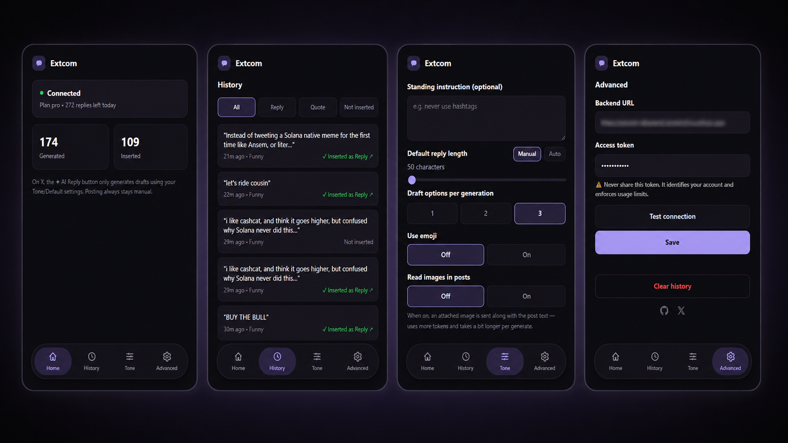
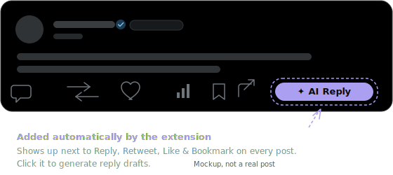

# Extcom AI Reply

A self-hosted, human-in-the-loop AI reply copilot for X/Twitter. A Chrome
extension adds an **✦ AI Reply** button to posts; your own backend generates
reply drafts with the AI provider key **you** control; you pick a draft, it is
inserted into the reply composer (or a Quote Tweet's comment box), and **you
always press Post yourself**.

- No SaaS, no signup, no telemetry: deploy the backend on your own VPS/PaaS.
- Your AI API key (OpenRouter or OpenAI) never leaves your server.
- Free and open source (MIT).

```txt
Chrome extension ──(your access token)──▶ your backend ──(your API key)──▶ AI provider
```

### Where configuration lives

- **Backend/server environment:** `OPENROUTER_API_KEY` or `OPENAI_API_KEY`,
  `AUTH_TOKENS`, optional `ADMIN_SECRET`, model, and database path.
- **Extension popup (Settings → Default):** default tone, standing
  instruction, default reply length, draft count, use emoji, read images.
- **Extension popup (Settings → Advanced):** public backend URL, one backend
  access token.

Never put an AI-provider API key or admin secret in the extension. Anything
stored by a browser extension must be treated as user-visible. The backend
access token identifies the user and enforces quota; it does not grant direct
access to the AI provider account.

## What it deliberately does NOT do

This is a copilot, not a bot:

- Never auto-clicks X's Post/Reply button.
- No mass replies, timeline scraping, or background auto-commenting.
- Automated posting may violate X's Terms of Service — the human-in-the-loop
  design is intentional. Use responsibly.

## 1. Deploy the backend

### Option A — Docker (recommended for a VPS)

```bash
git clone https://github.com/itsjawreal/extcom-ai.git
cd extcom-ai
cp .env.example .env       # fill in OPENROUTER_API_KEY and AUTH_TOKENS
docker compose up -d --build
curl http://localhost:3000/health
```

Put a reverse proxy with HTTPS in front (Caddy, nginx + certbot, Cloudflare
Tunnel, …). The extension talks to the URL you expose.

### Option B — Node directly

Requires Node.js ≥ 22.

```bash
npm ci
npm run build --workspace=@extcom-ai/backend
cd apps/backend
cp ../../.env.example .env  # fill it in
npm start
```

### Option C — Any Docker-based PaaS

The Dockerfile is the primary, portable deployment contract: it works the
same way on Railway, Render, Fly.io, Northflank, Zeabur, or any other
platform that can build from a Dockerfile. Set the variables from
`.env.example` in the platform's dashboard/CLI and attach persistent storage
mounted at `/data` (SQLite lives there). Per-platform walkthroughs:

| Platform | Build method | Persistent storage |
| --- | --- | --- |
| [Railway](docs/deploy-railway.md) | Dockerfile | Railway Volume mounted to `/data` |
| [Render](docs/deploy-render.md) | Dockerfile | Persistent Disk mounted to `/data` |
| [Fly.io](docs/deploy-fly.md) | Dockerfile | Fly Volume mounted to `/data` |
| Northflank | Dockerfile | Volume mounted to `/data` |
| Zeabur | Dockerfile | Volume mounted to `/data` |
| [VPS](docs/deploy-vps.md) | Docker Compose | Docker named volume mounted to `/data` |

Without persistent storage mounted at `/data`, the SQLite database (issued
tokens, usage counters) is lost on every redeploy or restart.

### Environment variables

| Variable | Required | Description |
| --- | --- | --- |
| `OPENROUTER_API_KEY` | yes* | API key when `AI_DEFAULT_PROVIDER=openrouter` (default). |
| `OPENAI_API_KEY` | yes* | API key when `AI_DEFAULT_PROVIDER=openai`. |
| `AI_DEFAULT_PROVIDER` | no | `openrouter` (default) or `openai`. |
| `AI_DEFAULT_MODEL` | no | e.g. `openrouter/auto`, `anthropic/claude-haiku-4.5`. |
| `AUTH_TOKENS` | yes | Comma-separated `token:plan` pairs. Invent a long random token and paste the same value into the extension popup. Plans `free`/`pro`/`power` only differ in rate limits — it's your own API key/bill either way, not a paid tier. Running this solo? Use `power` and forget about it; the tiers matter if you share your server/key with others and want to cap how much any one of them can spend. |
| `ADMIN_SECRET` | no | Enables `/v1/admin/tokens` for issuing extra tokens stored in SQLite (for sharing your server). Off when empty. |
| `DATABASE_PATH` | no | SQLite file (default `data/extcom-ai.db`; the Docker image uses `/data/extcom-ai.db` on a volume). |
| `EXTENSION_ORIGIN` | no | Extra allowed CORS origin. Extension origins (`chrome-extension://…`) are always allowed; authorization is the bearer token. |
| `APP_URL` | no | Sent to OpenRouter as `HTTP-Referer`. |
| `PORT` | no | Default `3000`. |

The backend exposes `GET /health`, `GET /v1/me` (bearer token, checks
connection/plan/remaining quota without consuming it), `POST
/v1/generate-reply` (bearer token), and `POST|GET /v1/admin/tokens` (admin
secret, optional).

## 2. Build & install the extension

```bash
npm ci
npm run build --workspace=@extcom-ai/extension
```

Then in Chrome (or any Chromium browser):

1. Open `chrome://extensions`, enable **Developer mode**.
2. **Load unpacked** → select `apps/extension/dist`.

## 3. Connect them

1. Click the **Extcom AI Reply** icon in the toolbar. The popup opens to
   **Home** — connection status, total generations, and total drafts
   inserted. A bottom nav switches between **Home**, **History**, **Tone**,
   and **Advanced**.
2. **History** tab: every generation, filterable by All / Reply / Quote /
   Not inserted, each entry with a ↗ link back to the post it was inserted
   into.
3. **Tone** tab: default tone (24 available, from `degen` to `roast` to
   `philosophical`, plus **Auto** which lets the AI pick whichever tone
   best fits each post — see `docs/API.md` for the full list, pin up to 5
   as quick-pick chips), standing instruction, default reply length (a
   fixed character count, or **Auto** to let the AI pick a natural length
   capped at 280 chars), draft count, and whether to use emoji / read
   images by default. See `docs/PROMPT.md` for exactly what's sent to the
   AI on every generation — none of it is configurable from the extension.
4. **Advanced** tab: enter your backend URL (e.g.
   `https://extcom.example.com`) and the access token you put in
   `AUTH_TOKENS`, then **Save**. Chrome will ask to allow access to your
   backend's domain — accept it. Also has **Test connection** and
   **Clear history**.



5. Open [x.com](https://x.com), find a post, click **✦ AI Reply**. Tone,
   draft count, reply length, emoji, and a one-off instruction just for this
   reply (added on top of your standing instruction, not a replacement) can
   all be overridden per-generation right in the on-page panel — it just
   falls back to your popup defaults when left untouched. If tone is Auto,
   the panel shows which tone the AI actually picked next to the usage line.
   Each draft has **Copy**, **↻** (regenerate just that draft), **Quote**
   (opens Repost → Quote and fills that comment box), and **Insert** (fills
   the reply composer). Edit the draft if you like, then press Post
   yourself.



Clicking it opens the on-page panel — tone, length, draft count, emoji, and
image toggles, then one card per generated draft with Copy/Regenerate/Quote/
Insert actions:


### Optional: let it read images in posts

The panel can attach every image in the post (up to 4, X's own per-post max)
to the AI request so replies can reference charts, memes, or screenshots —
off by default. Toggle **Read images** in Settings → Default, or
per-generation in the on-page panel (it only appears when the post has at
least one image). This **requires `AI_DEFAULT_MODEL` to be a vision-capable
model** (e.g. a
multimodal model on OpenRouter, or `gpt-4o`/`gpt-4.1`-class models on
OpenAI) — non-vision models typically just ignore the image rather than
erroring. See `docs/API.md` for the exact request shape.

### Reply chain context

If the post you're replying to is itself a nested reply, the extension
automatically includes the visible tweets it's replying to (and, on a status
permalink page, the original post at the top) as extra context for the AI —
no setting to toggle, this is always on when detectable. It only picks up
what's already rendered on the page.

## Sharing your server (optional)

Set `ADMIN_SECRET`, then issue tokens without touching env vars:

```bash
curl -X POST https://your-backend/v1/admin/tokens \
  -H "x-admin-secret: $ADMIN_SECRET" \
  -H "Content-Type: application/json" \
  -d '{"plan":"pro","label":"my friend"}'
```

Tokens are stored in SQLite (keep the Docker volume, or set `DATABASE_PATH`
somewhere persistent). `GET /v1/admin/tokens` lists them.

Rate limits per token: free 5/min & 20/day, pro 30/min & 300/day,
power 60/min & 1000/day (see `apps/backend/src/services/rateLimit.ts`).

## Development

```bash
npm ci
npm run dev --workspace=@extcom-ai/backend    # tsx watch on :3000
npm run dev --workspace=@extcom-ai/extension  # vite build --watch
npm run typecheck                            # all workspaces
npm test                                     # backend node:test suite
```

Without any configuration the extension defaults to `http://localhost:3000`
with the dev token `dev-local-token` (accepted only when `NODE_ENV` is not
`production`).

Repo layout: `apps/extension` (MV3, TypeScript + Vite; content script UI,
MAIN-world insert bridge, settings popup) and `apps/backend` (zero-dependency
Node `http` server; SQLite via `node:sqlite`).

## License

[MIT](LICENSE)
